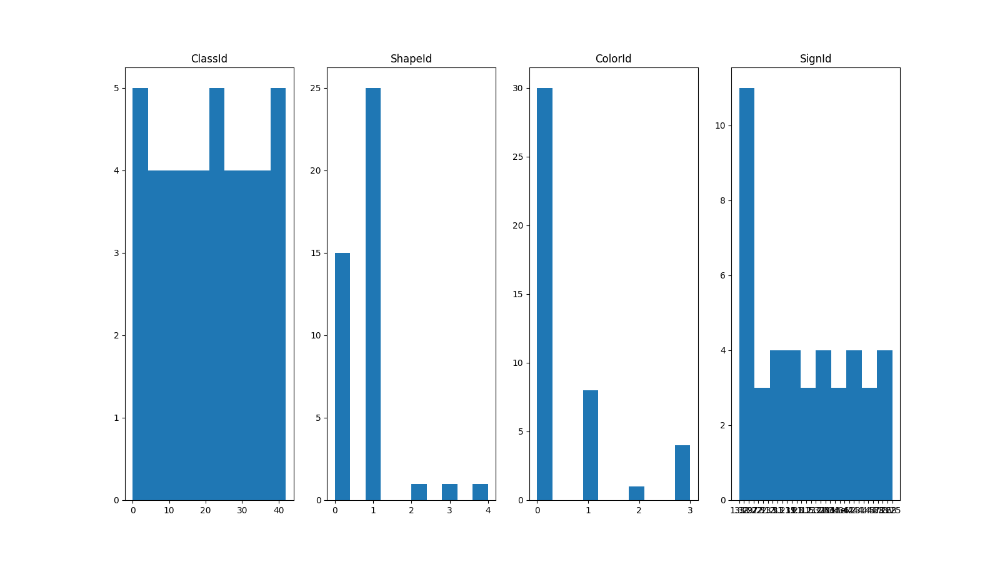
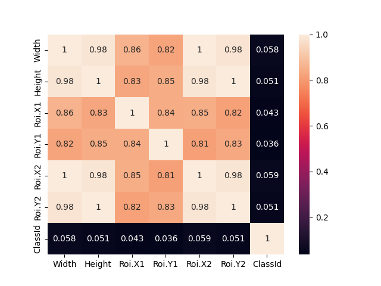
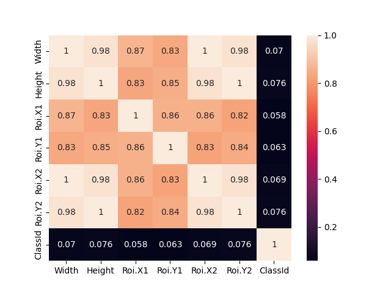
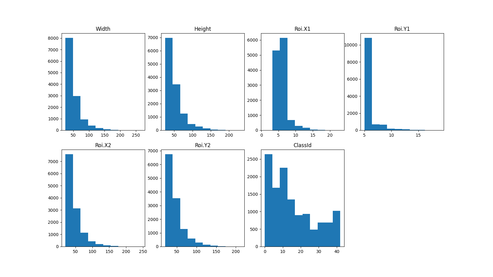
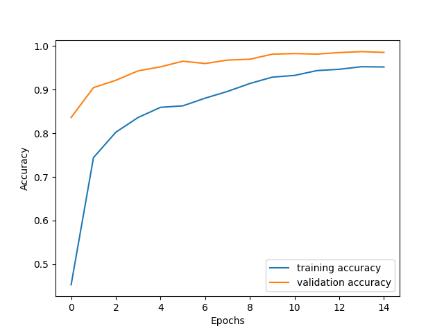
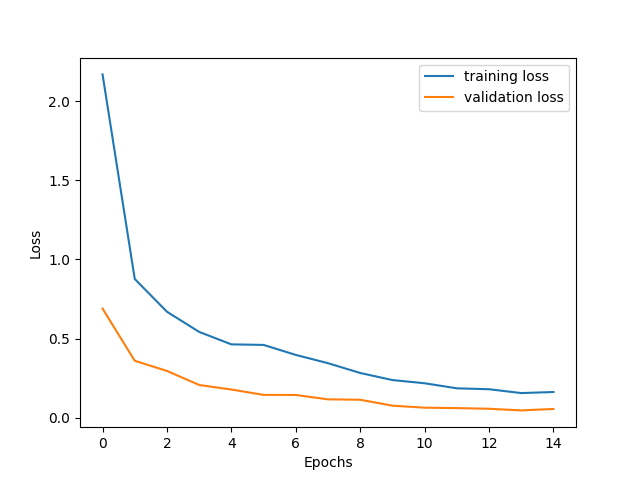
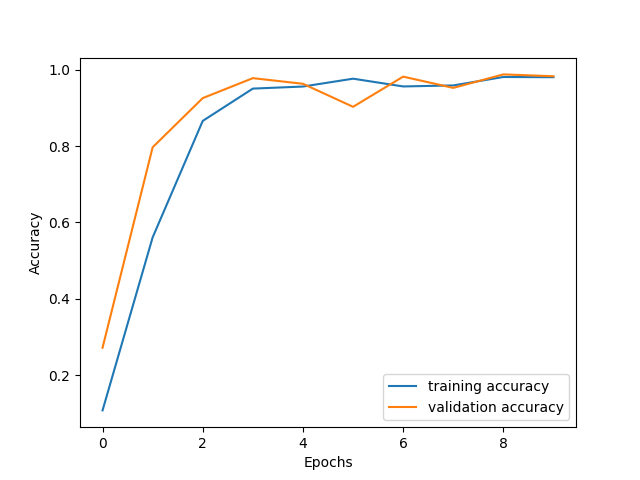
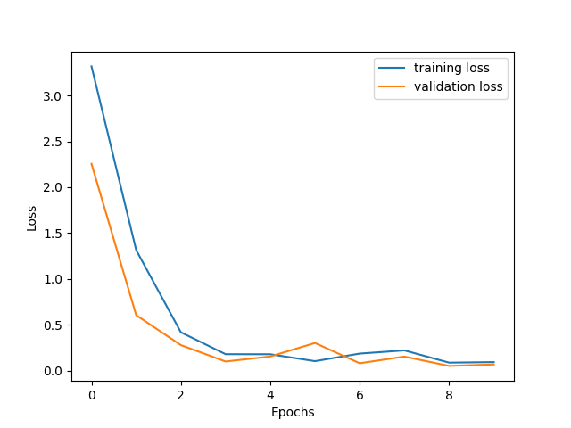

# Traffic-Sign-Classification
1. Introduction:
  1.1. Problem
  1.2. Literature review with links (another solutions)
  1.3. Current work (description of the work)
2. Data and Methods
  2.1. Information about the data (probably analysis of the data with some visualizations)
  2.2. Description of the ML models you used with some theory
3. Results
  3.1. Results with tables, pictures, and interesting numbers
4. Discussion
  4.1. Critical review of results
  4.2. Next steps 

1. Introduction

1.1. Problem

The development of artificial intelligence (AI) for self-driving vehicles is currently a very relevant and active area of research and development. Self-driving vehicles are currently being developed and tested by several companies and organizations, such as Tesla, Uber, Google, Mercedes-Benz, Toyota, Ford, Audi, etc. The ability of self-driving vehicles to navigate in difficult conditions, interact with other vehicles and pedestrians, and make decisions in real time largely depends on the capabilities of artificial intelligence systems. One of the important aspects of creating artificial intelligence for self-driving vehicles is to ensure safety and reliability. Thus, to achieve safety, vehicles must be able to interpret road signs and make appropriate decisions.
Traffic sign classification AI will also be a good help for training novice drivers who are just learning the rules of the road. 

1.2. Literature review with links

1. Build model that classifies traffic signs with 5 Tensorflow layers https://www.kaggle.com/code/valentynsichkar/traffic-signs-classification-with-cnn
2. Build model with 12 tensorflow layers and prevent overfitting of neural network that classifies traffic signs with Dropout https://data-flair.training/blogs/python-project-traffic-signs-recognition/
3. Using pretrained model for CNN problems https://keras.io/api/applications/vgg/
4. The Maxpooling layer https://www.educba.com/keras-maxpooling2d/
5. The Convolution layer https://www.databricks.com/glossary/convolutional-layer

1.3. Current work

	For this project, we are using the public dataset available at Kaggle that contains more than 50,000 images of different traffic signs. It is further classified into 43 different classes. Before starting the project, I installed the necessary packages, such as tensorflow, keras, numpy, matplotlib and sklearn, used for this Python data science project. 
	Steps to build project:
1. Preparing the dataset. I stored all the images and their labels into lists. Then I converted the images to a tensor and the labels to numpy arrays for feeding to the model. The shape of data is (39209, 32, 32, 3) which means that there are 39,209 images of size 32×32 pixels and the last 3 means the data contains colored images (RGB value). With the sklearn package, we use the train_test_split() method to split training and testing data.
2. Building CNN model. To classify the images into appropriate class I built two CNN models. The architecture of the first model consists of input, convolution, pooling and discarding layers. In general, it consists of 12 layers.  The second model was based on a pre-trained VGG 16 model.
3. Training and validating the model. After building the models architecture, I then trained the models using model.fit(). I tried with batch size 32 and 64. Models performed better with 64 batch size. First model accuracy was stable and high after 15 epochs. I have not been able to achieve stable accuracy in a pre-trained model. Overfitting took place after 15 epochs, that's why I fitted model for 10 epochs.
4. Testing and evaluating models. With matplotlib library, I plot the graph for accuracy and the loss for both of models. Then I predicted the models on test data using model.predict(). From the sklearn.metrics, I imported the accuracy_score and observed how models predicted the actual labels. Models achieved a 95% accuracy.
5. Building a graphical user interface. I used Tkinter which is a GUI toolkit in the standard python library. First, I loaded the trained model ‘traffic_classifier.h5’ using keras. And then I built the GUI for uploading the image and a button is used to classify which calls the classify() function. The classify() function is converting the image into the dimension of shape (1, 32, 32, 3). This is because to predict the traffic sign we have to provide the same dimension we have used when building the model. Then we predict the class, the model.predict_classes(image) returns us a number between 0-42 which represents the class. Then it uses the dictionary to get the information about the traffic sign’s class.

 
2. Data and Methods

2.1. Information about the data

Data contains 3 csv files and 3 folders with traffic sign images: meta, train, test. The first is meta data, which contains one image of each of the 43 classes of our traffic signs and 3 characteristics in the form of shape, color, sign, and class identifier of each sign. This file contains 43 rows, which are classes id, and 5 columns, which are features of these classes. In the figure below we can see the distribution of sampled columns. Values of “ColorId” column represent 0-red, 1-blue, 2-yellow, 3-white, values of “ShapeId” column represent 0-triangle, 1-circle, 2-diamond, 3-hexagon, 4-inverse triangle.

 
Next one is train data which contains Train.csv file and train folder. In the "Train" folder there are 43 more folders denoting classes, and in each folder, there are photos with the image of the road sign of the corresponding class. The Train.csv file contains 39209 rows, which corresponds to the number of train images, and 8 columns, which are the characteristics of each image: “Width” – width of image, “Height” – height of image, “Roi.X1” - upper left X coordinate of sign on image, “Roi.Y1” - upper left Y coordinate of sign on image, “Roi.X2” – lower right X coordinate of sign on image, “Roi.Y2” -  lower right Y coordinate of sign on image, “ClassId”, “Path”. In the figure below we can see the correlation between the columns.

 
In Figure 2 we can see the distribution for each column.

 
The third is the test data. The structure of the test data is the same as that of the train data, except that the “Test.csv” file contains 12630 rows that represent the number of images to model prediction. In the figure below we can see the correlation between the columns: “Width”,  “Height”, “Roi.X1”,  “Roi.Y1”,  “Roi.X2”,  “Roi.Y2”,  “ClassId”.

 
In Figure 2 we can see the distribution for each column.

 
The dataset is quite varying, some of the classes have many images while some classes have few images.

2.2. Description of the ML models you used with some theory

To classify the images into their respective categories, we will build a Convolutional Neural Network model. CNN is best for image classification purposes.
The architecture of our model is:
2 Conv2D layer (filter=32, kernel_size=(5,5), activation=”relu”)
MaxPool2D layer ( pool_size=(2,2))
Dropout layer (rate=0.25)
2 Conv2D layer (filter=64, kernel_size=(3,3), activation=”relu”)
MaxPool2D layer ( pool_size=(2,2))
Dropout layer (rate=0.25)
Flatten layer to squeeze the layers into 1 dimension
Dense fully connected layer (256 nodes, activation=”relu”)
Dropout layer (rate=0.5)
Dense layer (43 nodes, activation=”softmax”)
We compile the model with Adam optimizer which performs well and loss is “categorical_crossentropy” because we have multiple classes to categorise.
The most common type of convolution that is used is the 2D convolution layer. A kernel in a conv2D layer “slides” over the 2D input data, performing an elementwise multiplication. As a result, it will be summing up the results into a single output pixel. The kernel will perform the same operation for every location it slide over, transforming a 2D matrix of features into a different 2D matrix of features.
Keras MaxPooling2D is a pooling operation which calculates the largest value in every patch and the feature map. The results will be down sampled, or it will pool features map which was highlighting the most present feature into the patch which contains the average feature presence from the average pooling. The max pooling is found to work well in average pooling for vision tasks.
The Dropout layer is a mask that nullifies the contribution of some neurons towards the next layer and leaves unmodified all others. We applied a Dropout layer to a hidden layer, in which case it nullifies some hidden neurons. Dropout layers are important in training CNNs because they prevent overfitting on the training data.
I also built second model based on VGG16 pre-trained model. 

3. Results

3.1. Results with tables, pictures, and interesting numbers

Result for first model:
History plot of first model

  
	Accuracy score is: 0.94813.

Result for pre-trained model.
History plot of pretrained model

  
	Accuracy score is: 0.94814.

4. Discussion

4.1. Critical review of results

In this Python project I successfully classified the traffic signs classifier with 95% accuracy and visualized how our accuracy and loss changes with time, which is pretty good from a simple CNN model. I chose first model cause some portion of examples is classified randomly, which produces fluctuations of validation accuracy, as the number of correct random guesses always fluctuate. When classification produces random result is a common definition of overfitting. After having chosen a model for convenient use, I created an interface for users using the Python library.

4.2. Next steps

	This project can be developed by expanding the database so that the model could recognize all types of road signs in all countries. As I wrote earlier, the project is very useful for self-driving cars, so we can make the model to recognize traffic not only by pictures, but also by videos that were taken at any speed of the car.
